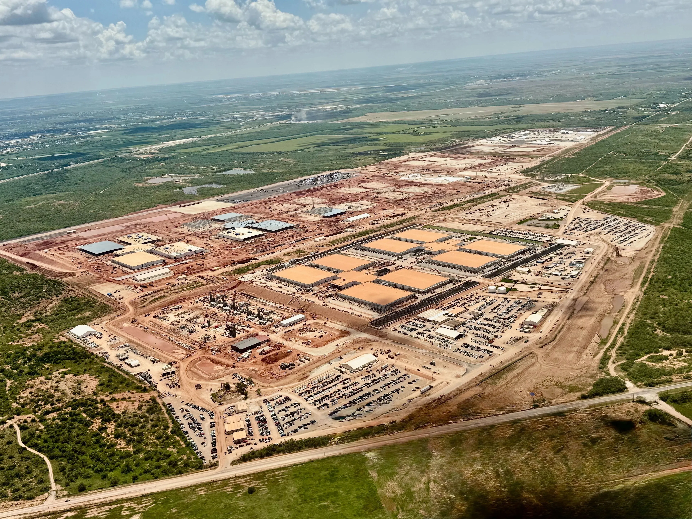

# Crusoe Energy - Energy Strategy & Technology Analysis

> **Research Report** | Last Updated: January 2025
> Deep dive into Crusoe's energy-first approach to AI infrastructure

**Note**: For company overview, products, and pricing, see [`neocloud-crusoe.md`](./neocloud-crusoe.md). This document focuses specifically on energy strategy, technologies, and economics.

## 📋 Executive Summary

Crusoe's core thesis: **energy sourcing should drive datacenter placement, not the other way around.** By deploying compute infrastructure where stranded or surplus energy exists (flared natural gas, curtailed renewables), the company claims 30-50% power cost advantages and $2-5B savings per gigawatt from bypassing grid interconnection.

**Key Energy Developments:**
- ⚡ **Energy Advantage**: 30-50% below market power costs through direct sourcing
- 🔄 **Strategic Pivot**: Sold Bitcoin mining and DFM business to NYDIG (March 2025)
- 🏗️ **Shift to Conventional Power**: Now building purpose-built natural gas plants (Chevron, GE Vernova, Kalina)
- 🌍 **Environmental Claims**: 2.7M metric tons CO2e avoided cumulatively (self-reported, no third-party verification)
- ♻️ **Future Vision**: Nuclear (1.5 GW by 2031), carbon capture (>90%), battery storage (EV batteries)

**Critical Observation**: Crusoe's energy strategy has evolved from "utilize waste energy" (DFM) to "build conventional power infrastructure behind-the-meter" (Chevron, Kalina). While the grid bypass advantage remains real, the "stranded energy moat" narrative diverges from operational reality.

---

## ⚡ Part 1: Energy Technology Portfolio

Crusoe's core differentiation lies in its energy sourcing and integration capabilities. The company has evolved from a single technology (DFM) to a portfolio of energy solutions.

### 🔥 Digital Flare Mitigation (DFM) - The Original Innovation

**What It Is:**
Digital Flare Mitigation captures natural gas that would otherwise be burned (flared) at oil production sites and converts it into electricity via portable generators and turbines to power modular datacenters deployed directly at the wellsite.

**The Problem It Solves:**
Oil production often yields associated natural gas that cannot economically reach pipeline infrastructure. Rather than shut down oil production, operators flare (burn) this gas. In the U.S. alone, approximately 1.4 billion cubic feet of natural gas is flared daily, representing both environmental harm and wasted energy.

**Technical Performance:**
- ✅ **99.9% combustion efficiency** (vs 91.1% average for traditional flares)
- ✅ **99.89% elimination of methane emissions**
- ✅ **97.7% available-for-service uptime**
- ✅ **63-68.6% reduction in CO2-equivalent emissions** vs continued flaring
- ✅ Significantly reduces NOx, CO, volatile organic compounds (VOCs), and methane

**Scale Achieved (before divestiture):**
- 250+ MW across 7 US states and Argentina
- 110+ mobile generation systems deployed
- 425+ modular datacenters
- 39+ billion cubic feet of gas abated (cumulative)
- Prevented 2.7 million metric tons CO2e emissions (cumulative 2018-2025)

**Company Policy (when operating DFM):**
Crusoe maintained strict prohibition on using gas that could reasonably reach traditional markets via pipeline, ensuring they only utilized truly stranded resources without incentivizing new drilling.

**🚨 Major Development: Sale to NYDIG (March 2025)**

In a strategic pivot, Crusoe sold its entire Digital Flare Mitigation and Bitcoin mining business to NYDIG in March 2025. The sale included:
- 425+ modular datacenters
- 270+ MW of power generation capacity
- All Bitcoin mining operations
- 135 employees transferred
- Crusoe became second-largest equity holder in the combined entity

CEO Cully Cavness explained: "The AI business — it's become the majority of our revenue." The fundamentally different requirements of AI workloads (uptime, scalability, energy sourcing consistency) versus Bitcoin mining drove the strategic decision to focus exclusively on AI infrastructure.

### 🌊 Digital Renewable Optimization (DRO) - The Renewable Pivot

**What It Is:**
DRO systems harness curtailed and stranded renewable energy by co-locating modular datacenters at renewable project substations and congested grid nodes saturated with renewable power.

**The Problem It Solves:**
Texas heavily developed with wind and solar faces massive curtailment:
- 2022: ERCOT curtailed 5% of wind, 9% of utility-scale solar
- 2035 projections: Wind curtailment could reach 13%, solar 19%
- This represents billions of dollars of wasted clean energy annually

**Technical Approach:**
- Co-location at behind-the-meter renewable facilities
- Absorbs energy that would otherwise be curtailed due to transmission constraints
- Operates entirely off-grid in remote areas with stranded renewable energy
- 100+ MW sites with behind-the-meter wind power access

**Current Scale:**
- First DRO site operational (2024): 100+ MW behind-the-meter wind
- **4 GW renewable pipeline** identified across multiple projects
- Deployments in wind, solar, geothermal sites

**Energy Mix Breakdown:**
- Wind: 1,508 MW under construction + 1,059 MW in discussion
- Solar: 705 MW under construction + 951 MW in pipeline
- Hydro/Geothermal: 18 MW deployed + 614 MW in development
- Nuclear: 34 MW under construction + 800 MW in discussion

### 🔌 Power Peninsula - Integration Architecture

**What It Is:**
Crusoe's proprietary utility network infrastructure that integrates multiple energy sources into a single, scalable network with real-time power optimization.

**Key Features:**
- Live power modeling and AI-centric design
- Dynamic resource dispatch matching compute workload profiles
- Integration of solar, wind, battery storage, hydro, natural gas, and geothermal
- On-site deployment reduces interconnection delays
- Flexible multi-source energy networks

**Strategic Value:**
Power Peninsula enables Crusoe to blend diverse energy sources, de-risking reliance on any single power type while optimizing for cost and availability. The platform represents their "all-of-the-above" energy sourcing strategy.

**Note:** Detailed technical specifications remain proprietary and not publicly disclosed.

### 📦 Crusoe Spark - Modular Edge Platform

**What It Is:**
Self-contained, modular datacenter platforms designed for edge deployment without traditional utility power dependency.

**Components:**
- Integrated power distribution systems
- Advanced liquid-to-chip cooling
- GPU-optimized server racks (supporting up to 100,000 GPUs per building on single network fabric)
- System monitoring in portable chassis
- Complete deployment in standardized containers

**Manufacturing:**
- Built in Crusoe Industries facilities (Arvada CO, Tulsa OK)
- 400+ units deployed globally in harsh conditions
- **3-month lead time** from order to deployment
- Designed for rapid deployment in remote locations

**Speed Advantage:**
- Traditional supplier quote: **100 weeks** for essential electrical components
- Crusoe in-house delivery: **22 weeks**
- **78% faster** through vertical integration

---

## 🤝 Part 2: Major Energy Partnerships

Crusoe's evolution beyond "stranded energy" is evident in its expanding portfolio of direct power partnerships and infrastructure deals.

### ⛽ Chevron Partnership - Natural Gas with Carbon Capture

**Announced:** January 2025
**Partners:** Crusoe + Engine No. 1 + Chevron
**Investment:** ~$8 billion (estimated)

**Structure:**
- 7 GE Vernova turbines purchased by Engine No. 1 and Chevron
- Crusoe gains access to power from all 7 turbines producing **up to 4.5 GW**
- Natural gas power with integrated carbon capture systems
- Timeline: Energy supply likely by 2027

**Technology Details:**
- GE Vernova LM2500XPRESS aeroderivative gas turbines
- 35 MW per unit (dual fuel capable)
- **90% lower emissions** than traditional reciprocating engines (via SCR technology)
- Minimal methane slip
- Designed with flexibility for post-combustion carbon capture (>90% CO2 capture)

**Strategic Significance:**
Represents shift from utilizing existing flared gas to purpose-built natural gas infrastructure with carbon capture, signaling evolution in Crusoe's energy strategy.

### ⚙️ GE Vernova Turbine Partnership

**Total Order:** 29 LM2500XPRESS units
**Timeline:**
- December 2024: 10 units ordered
- June 2025: 19 additional units ordered
- Combined output: Nearly **1 GW of electricity**

**Technical Specifications:**
- **35 MW** dual-fuel package per turbine
- LM2500 aeroderivative gas turbine + gas compressor + emissions control
- **SCR (Selective Catalytic Reduction)** technology transforms nitrogen oxides into water vapor and nitrogen
- **95% factory assembly** in simplified modules
- **5-minute fast start** capability (grid-independent)
- **Installation: as little as 2 weeks** per turbine

**Deployment Advantage:**
The rapid installation timeline (2 weeks vs months for traditional power plants) enables Crusoe to respond quickly to customer demand and scale capacity faster than competitors dependent on utility grid buildout.

### 🇨🇦 Kalina Power Partnership (Alberta, Canada)

**Announced:** Multiple framework agreements (2024-2025)
**Locations:** Alberta, Canada

**Project Structure:**
- Crusoe develops, owns, and operates datacenters
- Purchases power from **three Kalina-owned 170 MW gas-fired power plants**
- **15-year minimum term** Power Purchase Agreements

**Sites:**
1. Myers Energy Park
2. Alsike Energy Park
3. Crossfield Energy Park
Plus additional sites: Gilby, Clairmont (virtual PPAs/tolling arrangements)

**Investment Scale:**
- Each 170 MW Power-CCS plant: ~CAD $1 billion gross unlevered capex
- ~CAD $640 million net of cash rebate incentives

**Technology:**
- Power plants include **carbon capture and sequestration (CCS)**
- CCS capable of capturing **>90% of CO2 emissions**
- Combination of natural gas power with environmental mitigation

**Strategic Quote:**
Capitalizing on "Alberta's vast natural gas reserves to deliver reliable, affordable AI power with integrated carbon capture."

### 🔋 Redwood Materials - Battery Storage Partnership

**Announced:** June 2025
**Location:** Redwood Materials campus, Nevada

**Project Overview:**
North America's largest microgrid powered by second-life EV batteries.

**Technical Specifications:**
- **12 MW power capacity**
- **63 MWh energy storage**
- **805 retired EV batteries** across ~5 acres
- **20-acre solar array**
- Powers **2,000 GPU modular datacenter**

**Economics:**
- Cost: **$100-$200/kWh** (approximately half the cost of new lithium-ion systems)
- Built in **4 months**
- Already profitable and revenue-generating
- Batteries retain 70-80% of original capacity (suitable for second-life applications)

**Future Pipeline:**
- Redwood Materials: **1+ GWh in deployment pipeline**
- Expected **5+ GWh** in following year
- Future projects: **100+ MW storage** (10x+ larger than current deployment)

**Innovation:**
World's largest second-life EV battery deployment, demonstrating circular economy principles and creating new revenue stream for end-of-life EV batteries while providing cost-effective storage.

### ☢️ Blue Energy - Nuclear Partnership

**Announced:** Port of Victoria, Texas partnership
**Timeline:** Gas bridge (2028) → Nuclear transition (2031)

**Project Scale:**
- **1,600 acres** campus
- **Up to 1.5 GW nuclear** capacity
- **World's first gas-to-nuclear conversion** datacenter

**Approach:**
- Initial power (2028): Natural gas turbines
- Transition (2031): Small modular nuclear reactors (SMRs)
- **Build time: 36 months or less** through modular shipyard construction

**Technology Partner:**
Blue Energy (founded 2023) builds reactor-agnostic modular nuclear plants in shipyards, reducing construction time by **80%** compared to traditional nuclear builds.

**Strategic Significance:**
If successful, validates Crusoe's ability to deploy next-generation clean energy faster than traditional utilities, potentially creating blueprint for future AI datacenter energy sourcing.

### 🌍 Geographic Energy Partnerships

**Iceland - atNorth Partnership:**
- ICE02 facility: **57 MW** for Crusoe (expanded from 33 MW)
- 100% geothermal and hydroelectric power
- Latest expansion: **24 MW** (August 2025)
- NVIDIA GB200 NVL72 deployment (first liquid-cooled GB200 in Europe)

**Norway - Polar Partnership:**
- DRA01 facility: **12 MW initial**, expandable to **52 MW**
- 100% hydroelectric power
- Expected online late 2025
- Advanced liquid cooling up to **115kW per rack**

**Argentina - Unblock Computing:**
- Vaca Muerta oilfield DFM deployment
- Exclusive partnership in Argentina
- Part of 250+ MW DFM operations (now sold to NYDIG)

**Middle East Expansion:**
- Oman Investment Authority and Mubadala backing
- Expanding DFM technology to Middle East
- Addressing "region's long-standing flaring challenges"

---

## 🏗️ Part 3: Stargate Project - Energy Infrastructure at Hyperscale

*Aerial view of Crusoe's Stargate datacenter campus under construction in Abilene, Texas. The 900-acre site shows multiple datacenter buildings in various stages of completion, with red clay excavation visible across the planned 1.2 GW campus. Photo: Crusoe Energy*

The Stargate Project (Abilene, Texas) demonstrates Crusoe's energy-first approach at unprecedented scale: a $12B datacenter purpose-built around on-site power generation rather than grid connection.

**Energy Significance:**
- Validates that behind-the-meter power sourcing scales to hyperscale (1.2 GW)
- Demonstrates 6-month power deployment vs 2-3 years for traditional grid interconnection
- Proves energy-first model can compete with hyperscalers on enterprise reliability

For full Stargate project details (Oracle relationship, GPU specs, construction), see [neocloud-crusoe.md](./neocloud-crusoe.md).

### Project Structure

**Joint Venture Partners:**
- **Crusoe Energy**: Builds and co-owns datacenter infrastructure
- **Blue Owl Capital**: Real estate investment, co-sponsor
- **Primary Digital Infrastructure**: Datacenter infrastructure specialist, co-sponsor
- **Oracle**: Primary customer (15-year lease agreement)
- **OpenAI**: End user (via Oracle Cloud Infrastructure)

**Key Clarification:** Crusoe's direct customer is **Oracle**, not OpenAI. Oracle leases the facility under a 15-year agreement and provides services to OpenAI. This distinction matters for understanding revenue stability and customer concentration.

### Technical Specifications

**Phase 1 (2024-2025):**
- 2 buildings
- 200 MW capacity
- Construction began June 2024
- Energized H1 2025

**Phase 2 (2025-2026):**
- 6 additional buildings
- 1 GW capacity
- Construction began March 2025
- Operational mid-2026

**Full Campus (completion 2027):**
- **8 buildings total**
- **4 million square feet**
- **1.2 GW total capacity**
- **400,000 NVIDIA GB200 GPUs** planned
- Each building: **50,000 GB200 NVL72s on single network fabric**

**Network Architecture:**
- NVIDIA Quantum-2 InfiniBand
- 100,000 GPUs per building on single fabric
- Network capacity: 400 Gb/s per site (expanding to terabit range by end 2025)

### Energy Infrastructure

**Power Sourcing:**
- **4.5 GW natural gas** secured via joint venture with Engine No. 1 and Chevron
- 7 GE Vernova turbines
- Bypasses traditional grid interconnection
- On-site power generation eliminates multi-year grid approval processes

**Speed Advantage:**
Crusoe delivered new on-site power plant and energized first substation in **under 6 months**—a process that typically takes utilities 2-3 years through traditional grid interconnection.

### Financial Impact

**Original Projection (2024):** $10M revenue from Abilene project
**Updated Projection (2025):** **$250M revenue for 2026**
**Increase:** **25x revenue growth** from single customer

**Capacity Timeline:**
- **700+ MW live by December 2026**
- Full 1.2 GW campus through 2027
- Potential for expansion beyond initial scope

**Financing:**
- Phase 1: $3.4B (Blue Owl + Primary Digital Infrastructure, October 2024)
- Phase 2: $15B total joint venture (announced May 2025)
- JPMorgan Chase: $2.3B construction loan (January 2025)
- Brookfield Asset Management: $750M credit line to Crusoe (June 2025)

### Energy Infrastructure Takeaway

Stargate validates that Crusoe's energy-first model scales to hyperscale. The 6-month power deployment vs 2-3 year traditional timeline demonstrates competitive advantage through grid bypass. However, the 4.5 GW natural gas reliance shows the shift from "stranded energy" to conventional power generation.

---

## 💰 Part 4: Energy Economics - How Cost Advantage Works

### The Energy Cost Advantage Breakdown

Crusoe claims 30-50% lower energy costs translate to competitive advantage. Here's how the economics actually work:

**Seed Round (March 2019):**
- Investors: Founders Fund, Bain Capital Ventures, Winklevoss Capital
- Amount: Undisclosed

**Series A (December 2019): $30M**
- Lead: Bain Capital Ventures

**Series B (April 2021): $128M**
- Lead: Valor Equity Partners
- Participants: Lowercarbon Capital, DRW Venture Capital, Founders Fund, Bain Capital Ventures, Coinbase Ventures, Polychain Capital, KCK Group, Upper90, Winklevoss Capital, Exor, Zigg Capital, JB Straubel

**Series C (April 2022): $350M at $1.75B valuation**
- Lead: G2 Venture Partners
- New investors: Inclusive Capital Partners, Engine No. 1, Tao Capital, Felicis Ventures, Castle Island Ventures, Mitsui & Co., FootPrint Coalition Ventures (Robert Downey Jr.)
- **Valuation multiple:** 10.2x on $275M 2024 revenue (in hindsight)

**Series D (December 2024): $600M at $2.8B valuation**
- Lead: Founders Fund
- Participants: Fidelity Investments, **NVIDIA**, Lowercarbon Capital, Polychain Capital, Winklevoss Capital, DRW Trading Group, Mubadala, Valor Equity Partners, Ribbit Capital

**Series E (October 2025): $1.375B at $10B+ valuation**
- Co-Leads: Valor Equity Partners, Mubadala Capital
- Notable participants: 137 Ventures, 1789 Capital, Activate Capital, Altimeter Capital, Atreides Management, BAM Elevate, **DPR Construction** (also general contractor), Ora Global, Fidelity Management & Research Company, Founders Fund, Franklin Templeton, Galvanize, Long Journey Ventures, Lowercarbon Capital, M37 Management, MCJ, **NVIDIA**, Radical Ventures, Ribbit Capital, Salesforce Ventures, **Saquon Barkley** (NFL player), Spark Capital, StepStone Group, **Supermicro**, T. Rowe Price, Tiger Global Management, Upper90, Winklevoss Capital, Zigg Capital
- Expected later closing: Blue Owl funds
- **Valuation multiple:** ~36x on $276M 2024 revenue, or ~10x on $998M 2025 projected revenue

**Total Capital Raised:** ~$3.9B equity + additional debt facilities

**Valuation Trajectory:**
- April 2022: $1.75B
- November 2024: $2.8B (60% increase in 2.5 years)
- October 2025: $10B+ (257% increase in less than 1 year)

The dramatic valuation acceleration reflects Stargate's impact on enterprise credibility and revenue projections.

### Debt Facilities & Leverage

**Credit Facilities:**
- SVB Capital, Sparkfund, Generate Capital (expandable to $155M)
- Brookfield Asset Management: $750M credit line (June 2025)
- JPMorgan Chase: $2.3B construction financing for Stargate (January 2025)

**Interest Expense Growth:**
- 2023: **$27M**
- 2025 projected: **$297M** (11x increase)

This dramatic increase in interest expense reflects the capital-intensive nature of datacenter development and the leverage being employed to fund rapid expansion.

**Comparison with Competitors:**
- **CoreWeave:** >$10B in debt, debt-to-equity ratio exceeds 8x
- **Crusoe:** >$200M in traditional debt + construction financing
- **Lambda Labs:** >$500M in debt
- **Nebius:** Virtually **$0 debt** (key competitive differentiator)

### Customer Segments & Go-to-Market

**Enterprise & Hyperscale:**
- Oracle (Stargate project): 15-year lease, majority of near-term revenue
- Large AI training workloads requiring hundreds of GPUs for weeks-months

**Growth-Stage AI Companies:**
- Codeium (code completion AI model)
- Oasis (gaming/interactive AI): Scaled 5x capacity within hours, served 2M users in 4 days
- Windsurf (production AI on H100s)
- MirageLSD (product launch support)

**Infrastructure as a Service:**
- Three-tier offering:
  1. **Managed AI Software Solutions** (Platform as a Service)
  2. **AI Cloud Platform - CrusoeCloud** (Infrastructure as a Service)
  3. **Data Center Infrastructure** (Hyperscale facilities)

**Geographic Markets:**
- Primary: United States
- Europe: Iceland (57 MW), Norway (52 MW)
- Canada: Alberta (Kalina partnership)
- Latin America: Argentina (Vaca Muerta)
- Middle East: Expansion underway (Oman, UAE via Mubadala)

### Vertical Integration Strategy

**Atero Acquisition (August 2025): $150M**
- Israeli GPU management startup (stealth mode)
- Founders: CEO Alon Yariv, CTO Omer Landau
- Technology: "Dramatically improves GPU utilization, efficiency, and reliability"
- Establishes first R&D center in Tel Aviv
- Strategic rationale: Vertical integration in AI cloud stack

**Crusoe Industries (Manufacturing Division):**
- Established 2022 via acquisition of Easter-Owens
- Facilities: Arvada CO, Tulsa OK (~120,000 sq ft), Ponchatoula LA

**Products Manufactured:**
- Crusoe Spark modular datacenters
- Metal structures (PE-approved engineered buildings)
- Electrical enclosures (NEMA boxes, wireways, junction boxes)
- Industrial controls (VFDs, MCCs, UPS systems, PLCs, relay panels)
- Low voltage switchgear
- Power Distribution Centers (PDCs) with integrated relay protection

**Certifications:**
- ISO, UL (UL-approved facilities)
- NEMA, ISNetworld
- Interstate Industrialized Building Commission

**Speed Advantage:**
- 400+ units deployed globally
- 78% faster component delivery than external suppliers
- 3-month lead time from order to deployment

This vertical integration provides Crusoe with control over supply chain, faster deployment timelines, and potentially better unit economics compared to competitors dependent on third-party manufacturers.

---

**Note**: Technical platform details (GPUs, storage, networking, APIs) are covered in [`neocloud-crusoe.md`](./neocloud-crusoe.md). This document focuses on energy infrastructure.

---

## 🌱 Part 5: Environmental Impact & Sustainability

### Self-Reported Environmental Metrics

**Cumulative Impact (2018-2025):**
- **21+ billion cubic feet** of natural gas repurposed (flaring prevented)
- **2.5 TWh** of electricity generated from stranded energy
- **2.7 million metric tons CO2-equivalent (mtCO2e)** emissions avoided
- Equivalent to removing approximately **600,000+ cars** from roads for one year

**2024 Annual Performance:**
- **10.4 billion cubic feet** of flare gas converted
- **1.3 TWh** of electricity generated
- **87% of total electricity needs** supplied by DFM (previously wasted energy)
- **1.3 million mtCO2e** GHG emissions avoided
- Equivalent to removing **300,000 cars** from roads for one year

**2023 Performance:**
- 33 DFM sites across 6 states
- **5.4 billion cubic feet** of natural gas prevented from flaring
- **8,500+ metric tons** of methane emissions avoided
- **635,000+ MWh** of electricity generated from stranded energy
- 65% of grid-connected consumption from geothermal/hydroelectric sources

**DFM Technology Environmental Performance:**
- Each DFM-powered GPU reduces emissions by **~4.4 CO2e metric tons/year**
- **99.89% elimination of methane emissions**
- **63-68.6% reduction in CO2-equivalent emissions** vs traditional flaring
- Significantly reduces NOx, CO, volatile organic compounds (VOCs), and methane

### Verification & Certification Status

**Achieved Certifications:**
- ✅ **SOC 2 Type II** attestation (2024) for Crusoe Cloud data security and operations
- ✅ **Scope 1, 2, and 3 emissions tracking** via Emitwise platform (third-party GHG accounting software)
- ✅ Manufacturing facilities: **ISO, UL, NEMA, ISNetworld** certifications (Crusoe Industries)

**Commitments & Memberships:**
- Joined **iMasons Climate Accord**
- Total Recordable Injury Rate: **0.62**

**Methodology:**
- Analysis prepared by independent third-party emissions consultant
- Uses **U.S. EPA and ND DEQ methodologies** for calculations
- Note: Uses EPA-approved calculation methods but is not directly EPA-verified

**Not Yet Achieved:**
- ⏳ **ISO 14001** (Environmental Management) - mentioned as future goal, not current
- ❌ **Third-party carbon credit verification** (Verra, Gold Standard)
- ❌ **Independent environmental audits** of emissions claims (Bureau Veritas, SGS, etc.)

### ESG Reporting

**2022 ESG Report (First Ever):**
- Released May 2023
- Represents "important milestone for the company"
- Available as comprehensive PDF

**2024 Impact Report:**
- Published 2025
- Details DFM technology performance and environmental benefits
- Transparency on energy mix and sourcing

**Emissions Tracking Platform:**
- **Emitwise:** Third-party GHG accounting software
- Full Scope 1, 2, and 3 emissions tracking
- Public reporting on environmental impact

### Regulatory Context

**EPA Proposed Rule:**
Requires producers to route gas to device that reduces methane **≥95%**. Crusoe's claimed **99.89%** methane elimination exceeds this requirement.

**State-Level Regulations:**
- **New Mexico:** Flaring/venting limited to 2% of production by April 2022
- **North Dakota:** Incentives for on-site flare capture systems
- **Wyoming:** Incentives for flare gas reduction
- **BlackRock:** Called for end to routine flaring by 2025

These regulatory trends create favorable environment for flare mitigation solutions, though Crusoe has since divested this business.

### Carbon Capture & Future Roadmap

**Post-Combustion Carbon Capture:**
- Signed **term sheets** for post-combustion CCS development
- Integrated with natural gas partnerships (Chevron, Kalina)
- Target: **>90% CO2 capture** rates
- Technology: Amine scrubbing and other post-combustion capture methods
- Energy demand: 2.76-5.34 GJ/tCO2 depending on solvent

**Small Modular Nuclear Reactors (SMRs):**
- Term sheets signed for SMR projects
- Port Victoria: 1.5 GW nuclear by 2031
- Timeline: "Over the coming years"
- Goal: "Support and accelerate next generation of climate-aligned energy sources"

**Grid-Scale Battery Storage:**
- Redwood Materials: 63 MWh deployed, 1+ GWh pipeline
- Second-life EV battery integration
- Future projects: 100+ MW storage (10x current scale)

---

**Note**: Competitive landscape analysis is covered in [`neocloud-crusoe.md`](./neocloud-crusoe.md) and [neocloud-crusoe-energy-critical.md](./neocloud-crusoe-energy-critical.md).

---

## 🔮 Part 6: Future Energy Roadmap

### Energy Pipeline (20-45 GW Identified)

**Wind Power:**
- Under construction: **1,508 MW**
- In discussion: **1,059 MW**
- Total: **2,567 MW**

**Solar Power:**
- Under construction: **705 MW**
- In pipeline: **951 MW**
- Total: **1,656 MW**

**Nuclear Power:**
- Under construction: **34 MW**
- In discussion: **800 MW**
- Total: **834 MW**
- Port Victoria project: Up to **1.5 GW** by 2031

**Hydro & Geothermal:**
- Deployed: **18 MW**
- In development: **614 MW**
- Total: **632 MW**

**Flared Gas (now divested):**
- Historical: **200 MW** operational
- Identified: **140 MW** additional capacity
- Note: DFM business sold to NYDIG (March 2025)

**Carbon Capture:**
- Under construction: **378 MW**
- In development: **1,343 MW**
- Total: **1,721 MW**

**Total Identified Pipeline:** 20-45 GW across all sources

### Nuclear Development Strategy

**Port of Victoria, Texas (Blue Energy Partnership):**
- **Timeline:**
  - 2028: Initial power via natural gas bridge
  - 2031: Transition to nuclear generation
- **Capacity:** Up to 1.5 GW nuclear
- **Innovation:** World's first gas-to-nuclear conversion datacenter
- **Build time:** 36 months or less (modular shipyard construction)
- **Technology:** Small Modular Reactors (SMRs), reactor-agnostic

**Vendor:**
Blue Energy (founded 2023) builds modular nuclear plants in shipyards, reducing construction time by **80%** compared to traditional nuclear builds.

**Strategic Significance:**
If successful, validates ability to deploy next-generation clean energy faster than traditional utilities, creating potential template for future AI datacenter energy.

### Carbon Capture Scale-Up

**Current Commitments:**
- Term sheets signed for post-combustion CCS development
- Integrated with Chevron, Kalina partnerships
- Target: **>90% CO2 capture** rates

**Technology Approach:**
- Post-combustion capture (separates CO2 from exhaust after fuel combustion)
- Amine scrubbing and other industrial CCS methods
- Can be retrofitted to existing natural gas infrastructure

**Challenge:**
Industry reporting notes Crusoe "has found **few firms willing to pay for the green tech**," suggesting customer demand for CCS premium pricing remains limited despite corporate sustainability commitments.

### Space-Based Computing

**Starcloud Partnership (October 2025):**
- Vision: Deploy Crusoe Cloud operations in space
- **Satellite launch:** Late 2026
- **GPU capacity from orbit:** Q1 2027
- **Hardware:** NVIDIA H100 to space (November 2025)

**Rationale:**
- Space-based solar power access (10x lower energy costs claimed)
- Latency reduction for certain applications
- No thermal dissipation challenges in space environment
- Marketing differentiation

**Assessment:**
Highly experimental. Represents exploratory R&D rather than core business strategy.

### Geographic Expansion Plans

**Phase 1 (Current - 2025):**
- ✅ North America: US (primary), Canada (Alberta)
- ✅ Europe: Iceland (57 MW operational), Norway (52 MW deploying)

**Phase 2 (Near-term):**
- 🔄 Middle East: Oman, UAE (via Mubadala backing)
- 🔄 Latin America: Argentina expansion beyond Vaca Muerta

**Phase 3 (Future):**
- ⏳ Asia: "Further down" roadmap (not immediate priority)

**Strategic Rationale:**
"Pioneering outside of the traditional hubs for AI and technology, like California" to "benefit from first-mover advantage and create key partnerships with oil, gas, and AI companies in emerging markets."

### Platform Development Roadmap

**Managed Kubernetes:**
Job posting evidence indicates ongoing investment in Kubernetes orchestration capabilities, potentially competing with CoreWeave's K8s-native differentiation.

**AutoClusters & Managed Inference (Q2 2025):**
- Fault-tolerant orchestration for Slurm, Kubernetes
- Fully managed inference API
- Reduces infrastructure management complexity

**AMD GPU Expansion:**
- MI300X: Deployed (first-to-market virtualization)
- MI355X (288GB): Fall 2025 deployment
- Continued multi-vendor GPU strategy

**Storage Evolution:**
- VAST Data integration operational
- Potential expansion to additional storage vendors
- GPUDirect Storage optimization

### Wyoming Expansion

**Tallgrass Energy Partnership:**
- **Initial capacity:** 1.8 GW AI datacenter campus
- **Expansion potential:** Up to 10 GW
- **Energy:** Natural gas + future renewables integration
- **Infrastructure:** Proximity to Tallgrass CO2 sequestration hub
- **Status:** Development phase

If realized, would make Wyoming campus larger than Abilene (1.2 GW), positioning Crusoe as one of the largest AI infrastructure operators globally.

---

## 📚 Conclusion

Crusoe Energy represents a distinctive approach to AI infrastructure: prioritizing energy sourcing as the foundation rather than an afterthought. From its origins capturing flared natural gas for Bitcoin mining, the company has evolved into a $10 billion-valued hyperscale AI cloud provider powering 400,000 GPUs for OpenAI via Oracle.

**Key Achievements:**
- ✅ Demonstrated hyperscale capability (Stargate project)
- ✅ Energy cost advantage validated (30-50% below market)
- ✅ Vertical integration providing speed and control
- ✅ Strong financial backing ($3.9B equity raised, strategic investors including NVIDIA)
- ✅ Technical performance excellence (99.98% uptime)

**Strategic Evolution:**
The March 2025 sale of the Bitcoin mining and DFM business to NYDIG represents a definitive pivot from the company's origins. While DFM was the original "stranded energy" innovation, Crusoe's future increasingly relies on conventional power infrastructure (natural gas partnerships, nuclear development) enhanced by carbon capture and renewable integration.

**Competitive Position:**
Crusoe occupies a distinctive niche: larger and more enterprise-focused than Lambda Labs, more sustainability-oriented than CoreWeave, and differentiated by energy infrastructure control that hyperscalers cannot easily replicate. The Stargate project validates the company's ability to compete at hyperscale, while the energy moat provides structural cost advantages.

**Future Trajectory:**
With 20-45 GW of identified energy pipeline, nuclear ambitions, and expanding geographic footprint, Crusoe is positioned for continued rapid growth. The projected revenue trajectory from $276M (2024) to $5.5B (2028) requires flawless execution, but the Stargate project's $250M annual revenue provides significant validation.

The company's success ultimately depends on whether its energy-first approach creates sufficient competitive differentiation to overcome CoreWeave's 3-year head start and justify the $10B valuation in an increasingly competitive GPU cloud market.

---

**Sources & References:**
- Crusoe Energy official website and press releases
- Company impact reports (2022 ESG Report, 2024 Impact Report)
- Third-party analyst reports (Sacra, Cheddar Flow, FourWeekMBA)
- Industry publications (Data Center Dynamics, Hart Energy, TechCrunch)
- Financial news coverage (CNBC, Bloomberg, Reuters)
- Partnership announcements (GE Vernova, VAST Data, Redwood Materials, Kalina Power)
- Employee review sites (Glassdoor, Comparably)
- Technical documentation (Crusoe Cloud docs, VAST Data case studies)
- Regulatory filings and court records

*This report represents research compiled from publicly available sources as of January 2025. Financial projections and forward-looking statements are based on company guidance and analyst estimates.*
