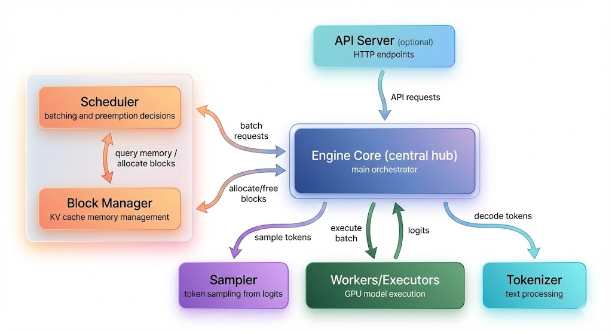

# vLLM Architecture Overview

## Overview

vLLM is a high-performance LLM inference engine built around the PagedAttention algorithm. The architecture follows a hub-and-spoke design where the Engine Core orchestrates all major components to maximize GPU utilization and throughput.

## Architecture Diagram

## Components

### 1. API Server (Entry Point)
- **Purpose**: HTTP endpoints for external requests
- **Protocol**: OpenAI-compatible API
- **Location**: `vllm/entrypoints/openai/`
- **Communication**: Sends requests to Engine Core

### 2. Engine Core (Central Hub)
- **Purpose**: Main orchestrator and request lifecycle manager
- **Location**: `vllm/v1/engine/llm_engine.py`
- **Responsibilities**:
  - Accept and track all requests
  - Coordinate the inference loop
  - Process outputs (sampling, detokenization, stopping criteria)
  - Manage request completion
- **Communication**: Talks to ALL other components (hub)

### 3. Scheduler (Resource Manager)
- **Purpose**: Memory-aware batch formation and preemption
- **Responsibilities**:
  - Decide which requests to process in each iteration
  - Handle preemption when memory is tight
  - Manage swapping between GPU/CPU memory
  - Priority-based queue management
- **Communication**:
  - Bidirectional with Engine Core (batch requests)
  - **Direct communication with Block Manager** (query available memory)

### 4. Block Manager (Memory Manager)
- **Purpose**: KV cache memory management using PagedAttention
- **Key Innovation**: Allocates KV cache in fixed-size blocks (like OS virtual memory paging)
- **Responsibilities**:
  - Allocate/free memory blocks on demand
  - Track block usage across sequences
  - Handle copy-on-write for beam search
- **Communication**:
  - Bidirectional with Engine Core (allocate/free blocks)
  - **Direct communication with Scheduler** (memory availability queries)

### 5. Workers/Executors (Computation)
- **Purpose**: Execute model forward passes on GPU(s)
- **Responsibilities**:
  - Load model weights
  - Run attention and MLP layers
  - Handle tensor parallelism across GPUs
  - Return logits
- **Communication**:
  - Receive batch execution requests from Engine Core
  - Return logits to Engine Core

### 6. Sampler (Token Generation)
- **Purpose**: Sample next tokens from model outputs
- **Responsibilities**:
  - Apply sampling strategies (top-k, top-p, temperature)
  - Beam search logic
  - Deterministic sampling
- **Communication**: Called by Engine Core with logits

### 7. Tokenizer (Text Processing)
- **Purpose**: Convert between text and token IDs
- **Responsibilities**:
  - Tokenize input prompts
  - Detokenize output tokens
  - Handle special tokens
- **Communication**: Called by Engine Core for encoding/decoding

## Communication Patterns

### Hub-and-Spoke Architecture
- **Engine Core** is the central hub that coordinates all components
- Most components only communicate through Engine Core
- **Exception**: Scheduler ↔ Block Manager have direct communication

### Why Scheduler ↔ Block Manager are Coupled
Scheduling decisions are fundamentally memory-constrained:
- Scheduler needs real-time memory availability to form batches
- Can't decide batch size without knowing free KV cache blocks
- This tight coupling is by design for PagedAttention efficiency

## Key Technical Challenges

1. **Continuous Batching**: Dynamically adding/removing requests as they complete
2. **Memory Management**: Maximizing GPU memory utilization with paged KV cache
3. **Throughput Optimization**: Keeping GPUs busy while respecting memory limits
4. **Distributed Execution**: Coordinating across multiple GPUs (tensor/pipeline parallelism)
