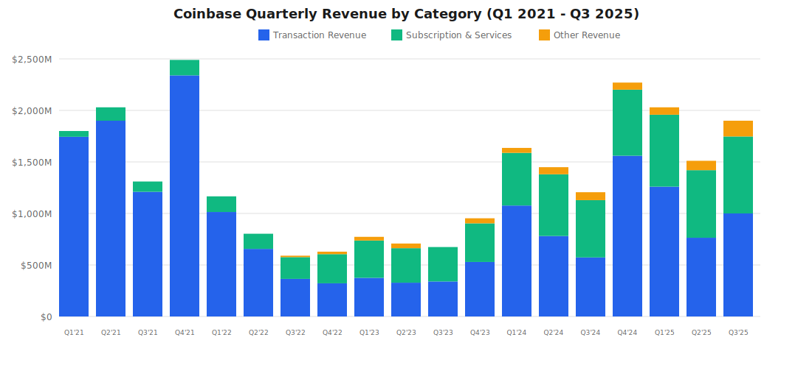

# Coinbase: Quarterly Financial Data

## Quarterly Results (Q1 2021 - Q3 2025) - Complete History Since IPO

| Quarter | Revenue | Net Income (Loss) | YoY Revenue Growth | QoQ Revenue Growth | Notes |
|---------|---------|-------------------|-------------------|-------------------|-------|
| [**Q1 2021**](https://investor.coinbase.com/news/news-details/2021/Coinbase-Announces-First-Quarter-2021-Estimated-Results-and-Full-Year-2021-Outlook/default.aspx) | $1,800M | ~$800M | N/A | N/A | Pre-IPO quarter (IPO April 14, 2021) |
| [**Q2 2021**](https://s27.q4cdn.com/397450999/files/doc_financials/2021/q2/Coinbase-Q2'21-Shareholder-Letter.pdf) | $2,030M | $1,600M | N/A | +13% | First full quarter as public company |
| [**Q3 2021**](https://s27.q4cdn.com/397450999/files/doc_financials/2021/q3/Coinbase-Q321-Shareholder-Letter.pdf) | $1,310M | $406M | N/A | -35% | Mid-2021 crypto correction |
| [**Q4 2021**](https://investor.coinbase.com/financials/quarterly-results/default.aspx) | $2,490M | $840M | N/A | +90% | Strong year-end rally |
| [**Q1 2022**](https://s27.q4cdn.com/397450999/files/doc_financials/2022/q1/Coinbase-Q122-Shareholder-Letter.pdf) | $1,166M | -$430M | -35% | -53% | Crypto winter begins |
| [**Q2 2022**](https://investor.coinbase.com/financials/quarterly-results/default.aspx) | $803M | -$1,100M | -60% | -31% | Deep bear market |
| [**Q3 2022**](https://www.sec.gov/Archives/edgar/data/1679788/000167978822000115/a20221103shareholderlett.htm) | $590M | -$545M | -55% | -27% | Continued decline |
| [**Q4 2022**](https://s27.q4cdn.com/397450999/files/doc_financials/2022/q4/Shareholder-Letter-Q4-2022.pdf) | $629M | -$557M | -75% | +7% | Bottoming process |
| [**Q1 2023**](https://s27.q4cdn.com/397450999/files/doc_financials/2023/q1/Shareholder-Letter-Q1-2023.pdf) | $773M | Loss | -34% | +23% | Crypto winter recovery begins |
| [**Q2 2023**](https://s27.q4cdn.com/397450999/files/doc_financials/2023/q2/Shareholder-Letter-Q2-2023.pdf) | $708M | -$97M | -12% | -8% | Still in bear market |
| [**Q3 2023**](https://investor.coinbase.com/financials/quarterly-results/default.aspx) | $674M | -$2M | +14% | -5% | Nearly break-even, trough |
| [**Q4 2023**](https://s27.q4cdn.com/397450999/files/doc_financials/2023/q4/Shareholder-Letter-Q4-2023.pdf) | $953M | $273M | +52% | +41% | First profit in 2 years |
| [**Q1 2024**](https://s27.q4cdn.com/397450999/files/doc_financials/2024/Shareholder-Letter-Q1-2024.pdf) | $1,636M | $1,180M | +112% | +72% | Bitcoin ETF launch, BTC $73K peak |
| [**Q2 2024**](https://s27.q4cdn.com/397450999/files/doc_financials/2024/q2/Q2-24-Shareholder-Letter.pdf) | $1,449M | $36M | +105% | -11% | Sequential decline from Q1 |
| [**Q3 2024**](https://s27.q4cdn.com/397450999/files/doc_financials/2024/q3/Q3-24-Shareholder-Letter.pdf) | $1,206M | $75M | +79% | -17% | Continued softening |
| [**Q4 2024**](https://s27.q4cdn.com/397450999/files/doc_financials/2024/q4/Q4-24-Shareholder-Letter.pdf) | $2,270M | $1,300M | +138% | +88% | Post-election crypto rally |
| [**Q1 2025**](https://s27.q4cdn.com/397450999/files/doc_financials/2025/q1/v2/Q1-25-Shareholder-Letter-1.pdf) | $2,030M | $66M | +24% | -11% | Big miss vs analyst expectations |
| [**Q2 2025**](https://s27.q4cdn.com/397450999/files/doc_financials/2025/q2/Q2-2025-Shareholder-Letter.pdf) | $1,500M | $1,400M* | +4% | -26% | *Includes $1.5B gain on investments |
| [**Q3 2025**](https://investor.coinbase.com/files/doc_financials/2025/q3/Q3-25-Shareholder-Letter.pdf) | $1,900M | $433M | +58% | +27% | Recovery from Q2 |

**Notes:**
- Q2 2025 net income includes $1.5B gain on strategic investments and $362M gain on crypto investments
- Coinbase went public via direct listing on April 14, 2021 (Q2 2021)

### Quarterly Revenue Visualization

---

## Full Year Results

| Year | Revenue | Net Income (Loss) | Net Margin | YoY Revenue Growth |
|------|---------|-------------------|------------|-------------------|
| **2021** | $7,400M | $3,600M | 49% | N/A |
| **2022** | $3,200M | -$2,600M | -81% | -57% |
| **2023** | $3,108M | $95M | 3% | -3% |
| **2024** | $6,561M | $2,591M | 39% | +111% |
| **2025** (9 months) | $5,430M | $1,899M | 35% | N/A |

---

## Key Metrics by Quarter (Q3 2025)

### Revenue Breakdown

| Revenue Source | Q3 2025 | Q2 2025 | Q1 2025 | Q4 2024 | Q3 2024 | Q2 2024 | Q1 2024 | Q4 2023 | Q3 2023 | Q2 2023 | Q1 2023 | Q4 2022 | Q3 2022 | Q2 2022 | Q1 2022 | Q4 2021 | Q3 2021 | Q2 2021 | Q1 2021 |
|----------------|---------|---------|---------|---------|---------|---------|---------|---------|---------|---------|---------|---------|---------|---------|---------|---------|---------|---------|---------|
| 🔸 **Transaction Revenue** | $1,000M | $764M | $1,260M | $1,560M | $573M | $781M | $1,077M | $529M | $340M | $328M | $375M | $322M | $365M | $656M | $1,014M | $2,340M | $1,210M | $1,900M | $1,744M |
| Consumer (Retail) | $844M | $650M | N/A | N/A | N/A | $665M | $935M | $493M | N/A | N/A | N/A | N/A | $346M | $616M | N/A | N/A | N/A | N/A | N/A |
| Institutional | $135M | $61M | N/A | N/A | N/A | $64M | $85M | $37M | N/A | N/A | N/A | N/A | N/A | N/A | N/A | N/A | $68M | N/A | N/A |
| Other (Base sequencer) | N/A | N/A | N/A | N/A | N/A | N/A | $56M | N/A | N/A | N/A | N/A | N/A | N/A | N/A | N/A | N/A | N/A | N/A | N/A |
| 🔸 **Subscription & Services** | $747M | $656M | $698M | $641M | $556M | $599M | $511M | $375M | $334M | $335M | $362M | $283M | $211M | $147M | $152M | $150M | $100M | $130M | $56M |
| Stablecoin Revenue | $355M | $333M | N/A | $226M | N/A | N/A | $197M | $172M | N/A | N/A | N/A | N/A | N/A | N/A | N/A | N/A | N/A | N/A | N/A |
| Staking Revenue | $185M | $145M | N/A | N/A | $154M | N/A | $151M | $95M | N/A | N/A | N/A | N/A | N/A | N/A | N/A | N/A | N/A | N/A | N/A |
| Interest Income | $65M | N/A | N/A | N/A | N/A | N/A | $67M | $43M | N/A | N/A | $241M | N/A | N/A | N/A | N/A | N/A | N/A | N/A | N/A |
| Custody & Other | $143M | N/A | N/A | $91M | N/A | N/A | $96M | $65M | N/A | N/A | N/A | N/A | N/A | N/A | N/A | N/A | N/A | $32M | N/A |
| 🔸 **Other Revenue** | $153M | $91M | $72M | $69M | $77M | $69M | $48M | $49M | N/A | N/A | N/A | $24M | $14M | N/A | N/A | N/A | N/A | N/A | N/A |
| 🔸 **Total Revenue** | $1,900M | $1,500M | $2,030M | $2,270M | $1,206M | $1,449M | $1,636M | $953M | $674M | $708M | $773M | $629M | $590M | $803M | $1,166M | $2,490M | $1,310M | $2,030M | $1,800M |

---

## Profitability Metrics

| Metric | Q3 2025 | Q2 2025 | Q1 2025 | Q4 2024 | Q3 2024 |
|--------|---------|---------|---------|---------|---------|
| **Revenue** | $1,900M | $1,500M | $2,030M | $2,270M | $1,206M |
| **Net Income** | $433M | $1,400M* | $66M | $1,300M | $75M |
| **Net Margin** | 23% | 93%* | 3% | 57% | 6% |
| **Adjusted EBITDA** | $801M | $512M | $930M | N/A | $449M |
| **Adjusted EBITDA Margin** | 42% | 34% | 46% | N/A | 37% |

*Q2 2025 includes $1.86B in investment gains

---

## Trading Volume Trends

| Quarter | Consumer Volume | Institutional Volume | Total Volume | QoQ Change |
|---------|----------------|---------------------|--------------|------------|
| Q1 2024 | $56B | $256B | $312B | +93% |
| Q2 2024 | $38B | $123B | $161B | -48% |
| Q3 2024 | N/A | N/A | $185B | +15% |
| Q4 2024 | N/A | N/A | $439B | +137% |
| Q1 2025 | $78B | $315B | $393B | -10% |
| Q2 2025 | $43B | N/A | N/A | -45% (retail) |
| Q3 2025 | N/A | N/A | N/A | N/A |

---

## Historical Volatility Analysis (Since IPO)

### Quarterly Revenue Range (Q1 2021 - Q3 2025)

- **Highest Quarter:** Q4 2021 ($2,490M)
- **Lowest Quarter:** Q3 2022 ($590M)
- **All-Time Volatility Range:** 4.2x difference
- **Recent High:** Q4 2024 ($2,270M)
- **Recent Low (2023):** Q3 2023 ($674M)

### Quarterly Net Income Range

- **Highest Profit:** Q2 2021 ($1,600M)
- **Biggest Loss:** Q2 2022 (-$1,100M)
- **Profit/Loss Swing:** $2,700M range
- **Most Typical Profit:** $200-500M range (in profitable quarters)
- **Most Typical Loss:** -$100M to -$600M (in unprofitable quarters)

*Note: Q2 2025 $1,400M profit is anomaly due to $1.86B investment gains

### Year-over-Year Growth Volatility

| Quarter | Revenue YoY Growth | Notes |
|---------|-------------------|-------|
| Q1 2022 | -35% | First YoY comparison (vs Q1 2021) |
| Q2 2022 | -60% | Steep decline from 2021 peak |
| Q3 2022 | -55% | Continued bear market |
| Q4 2022 | -75% | Worst YoY decline |
| Q1 2023 | -34% | Recovery begins |
| Q2 2023 | -12% | Decline moderating |
| Q3 2023 | +14% | First YoY growth since crypto winter |
| Q4 2023 | +52% | Strong recovery |
| Q1 2024 | +112% | Massive surge (Bitcoin ETF) |
| Q2 2024 | +105% | Continued bull market |
| Q3 2024 | +79% | Still strong growth |
| Q4 2024 | +138% | Peak YoY growth |
| Q1 2025 | +24% | Growth moderating |
| Q2 2025 | +4% | Sharp slowdown |
| Q3 2025 | +58% | Rebound |

**Key Insights:**
- **Largest YoY Growth:** Q4 2024 (+138%)
- **Largest YoY Decline:** Q4 2022 (-75%)
- **Average YoY Volatility:** ±80% swing quarter-to-quarter
- **Pattern:** Extreme boom-bust cycles tied to crypto market

---

## Data Sources

All data compiled from official Coinbase investor relations materials:

### Current Period (2024-2025)
- [Coinbase Investor Relations - Quarterly Earnings](https://investor.coinbase.com/financials/quarterly-results/default.aspx)
- [Q3 2025 Shareholder Letter](https://investor.coinbase.com/files/doc_financials/2025/q3/Q3-25-Shareholder-Letter.pdf)
- [Q2 2025 Shareholder Letter](https://s27.q4cdn.com/397450999/files/doc_financials/2025/q2/Q2-2025-Shareholder-Letter.pdf)
- [Q1 2025 Shareholder Letter](https://s27.q4cdn.com/397450999/files/doc_financials/2025/q1/v2/Q1-25-Shareholder-Letter-1.pdf)
- [Q4 2024 Shareholder Letter](https://s27.q4cdn.com/397450999/files/doc_financials/2024/q4/Q4-24-Shareholder-Letter.pdf)

### Historical Period (2021-2023)
- [Q3 2021 Shareholder Letter](https://s27.q4cdn.com/397450999/files/doc_financials/2021/q3/Coinbase-Q321-Shareholder-Letter.pdf)
- [Q2 2021 Shareholder Letter](https://s27.q4cdn.com/397450999/files/doc_financials/2021/q2/Coinbase-Q2'21-Shareholder-Letter.pdf)
- [Q1 2022 Shareholder Letter](https://s27.q4cdn.com/397450999/files/doc_financials/2022/q1/Coinbase-Q122-Shareholder-Letter.pdf)
- [Q4 2022 Shareholder Letter](https://s27.q4cdn.com/397450999/files/doc_financials/2022/q4/Shareholder-Letter-Q4-2022.pdf)

### Additional Sources
- [Coinbase Q1 2021 Results Announcement](https://investor.coinbase.com/news/news-details/2021/Coinbase-Announces-First-Quarter-2021-Estimated-Results-and-Full-Year-2021-Outlook/default.aspx)
- News articles from CNBC, TechCrunch, CoinDesk, and The Block for supplementary context

**Data Coverage:** Q1 2021 (pre-IPO) through Q3 2025

**Data Last Updated:** December 7, 2025 (through Q3 2025 results)

**Note:** Coinbase went public via direct listing on April 14, 2021. All quarterly data represents public company reporting.
